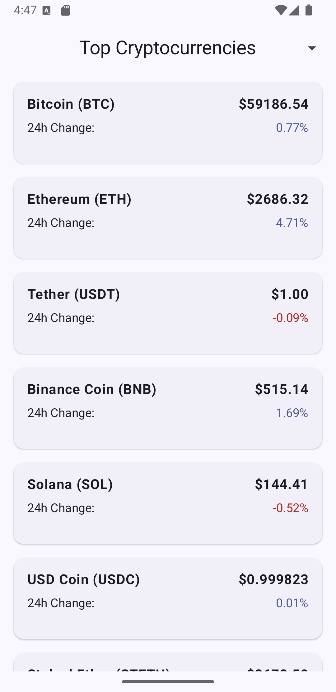

# Top Cryptocurrencies Tracker 📈

A Jetpack Compose-based Android application that tracks the top cryptocurrencies in real-time. The app displays key information such as price, 24h change, and allows sorting by different criteria like price and percentage change.

## Features 🚀

- **Live Cryptocurrency Data**: Fetches real-time data from the CoinLore API.
- **Sorting**: Sort coins by price or 24h change.
- **Material Design 3**: Uses Jetpack Compose with Material 3 for a modern and responsive UI.
- **Clean Architecture**: Follows best practices for MVVM architecture.

## Screenshots 📸



## Technologies Used 🛠

- **Kotlin**: The programming language used for Android development.
- **Jetpack Compose**: Android's modern toolkit for building native UI.
- **ViewModel**: Manages UI-related data in a lifecycle-conscious way.
- **CoinLore API**: Provides the cryptocurrency data.
- **Material Design 3**: Implements Google's latest design language.

## Installation & Setup 🔧

1. **Clone the repository:**
   ```bash
   git clone https://github.com/yourusername/top-cryptocurrencies-tracker.git
   cd top-cryptocurrencies-tracker
   ```
2. **Open in Android Studio:**
- Open the project in Android Studio.
- Sync the project with Gradle files.
3. **Run the app:**
- Connect your Android device or use an emulator.
- Click on the "Run" button in Android Studio.

## Usage 📲
- Sort by Price: Click on the "Sort by" dropdown in the top bar and select "Price" to sort coins by their current price.
- Sort by 24h Change: Select "24h Change" to sort coins by their percentage change in the last 24 hours.

## API Integration 🌐
This app uses the CoinLore API to fetch live cryptocurrency data. To learn more about the API and its capabilities, visit their documentation.

## Contributing 🤝
Contributions are welcome! Please follow these steps:
1. Fork the repository.
2. Create a new branch (git checkout -b feature-branch).
3. Commit your changes (git commit -am 'Add new feature').
4. Push to the branch (git push origin feature-branch).
5. Create a pull request.
